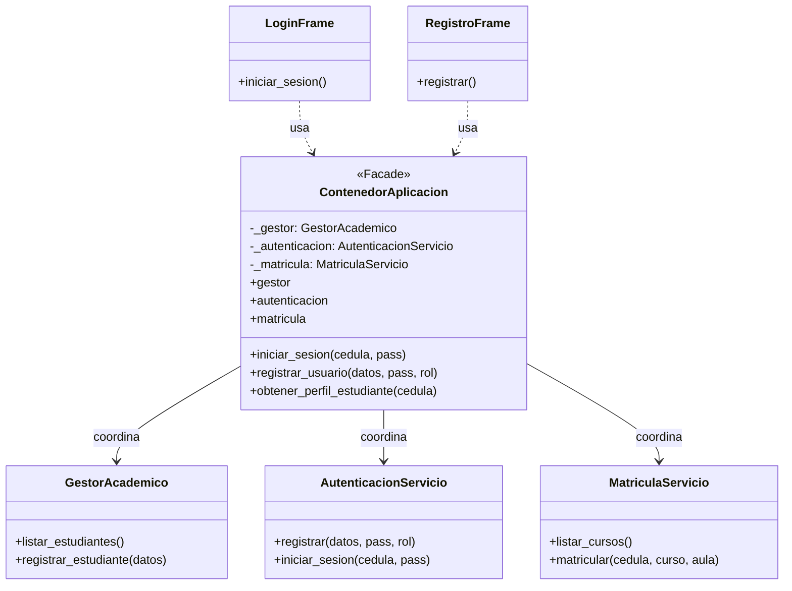
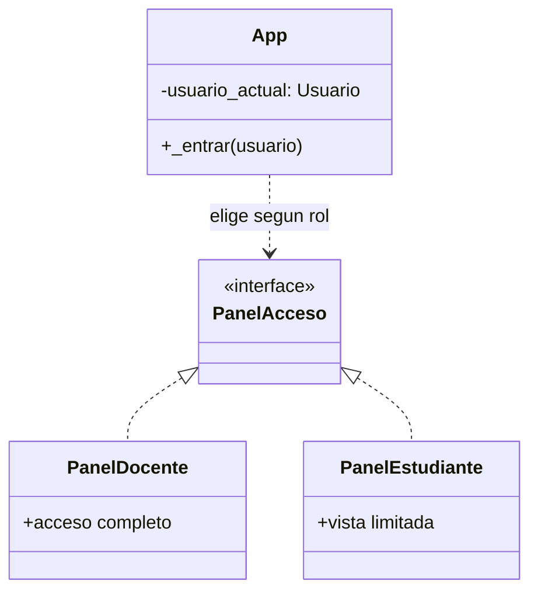
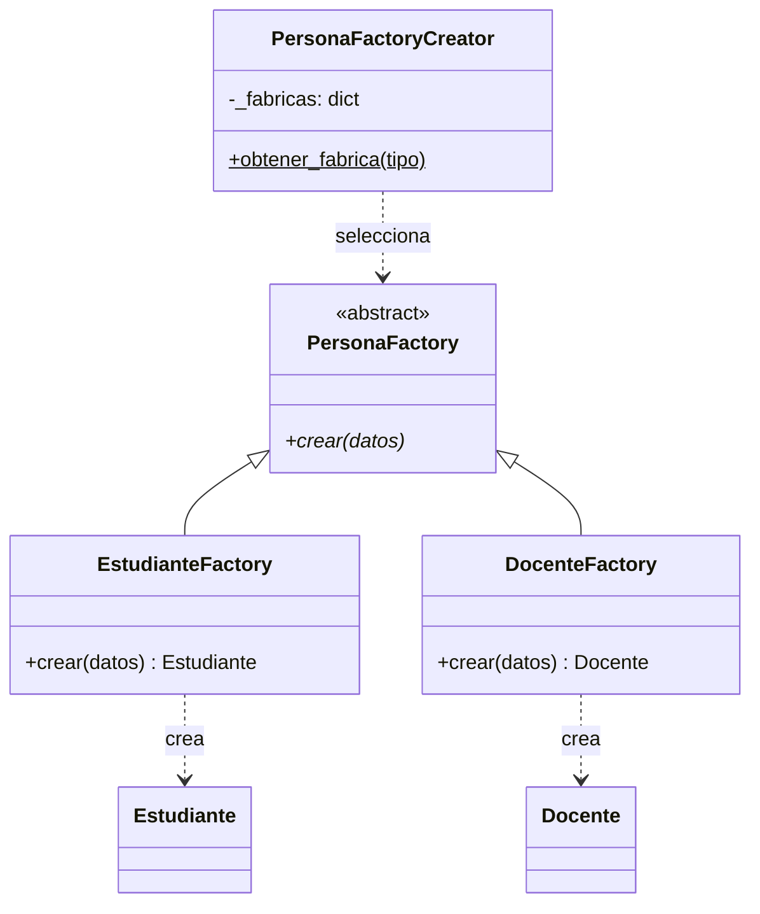

# Diagramas UML — Patrones de Diseño

## Facade

`ContenedorAplicacion` actúa como Facade: las Vistas (Login, Registro) 
solo interactúan con él, sin conocer los 3 servicios internos que coordina.

## Strategy

`App._entrar()` decide qué panel mostrar según el rol del usuario. 
`PanelDocente` y `PanelEstudiante` son estrategias intercambiables: 
comparten el mismo propósito (mostrar la interfaz principal) pero cada 
una implementa un comportamiento distinto según el rol.

## Factory Method

`PersonaFactoryCreator` selecciona la fábrica adecuada según el tipo de 
persona a crear. Cada fábrica concreta (`EstudianteFactory`, `DocenteFactory`) 
sabe construir su propio tipo, sin que el código cliente conozca los detalles.

